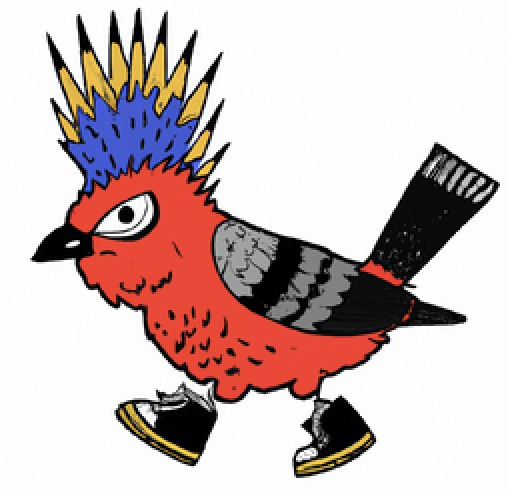

<a name="readme-top"></a>

<!-- INSERT STATUS BADGES HERE -->

<!-- PROJECT LOGO -->
<br />
<div align="center">
  <a href="https://github.com/justintsugranes/">
    
  </a>

<h3 align="center">justintsugranes.com</h3>

  <h1 align="center">Goal Setting MERN App</h1>

  <p align="center">
    <a href="https://github.com/justintsugranes/project_mern-goals-app"><strong>Explore the docs »</strong></a>
    <br />
    <a href="https://justintsugranesmerngoalsapp.herokuapp.com/">View Demo</a>
    ·
    <a href="https://github.com/justintsugranes/project_mern-goals-app/issues">Report Bug</a>
    ·
    <a href="https://github.com/justintsugranes/project_mern-goals-app/issues">Request Feature</a>
  </p>
</div>

<!-- TABLE OF CONTENTS -->
<details>
  <summary>Table of Contents</summary>
  <ol>
    <li>
      <a href="#about-the-project">About The Project</a>
      <ul>
        <li><a href="#built-with">Built With</a></li>
      </ul>
    </li>
    <!-- <li>
      <a href="#getting-started">Getting Started</a>
      <ul>
        <li><a href="#prerequisites">Prerequisites</a></li>
        <li><a href="#installation">Installation</a></li>
      </ul>
    </li>
    <li><a href="#usage">Usage</a></li>
    <li><a href="#roadmap">Roadmap</a></li> -->
    <li><a href="#license">License</a></li>
    <li><a href="#contact">Contact</a></li>
  </ol>
</details>

<!-- ABOUT THE PROJECT -->

## About The Project

[![Project Screen Shot][project-screenshot]][project-url]
[![Contributors][contributors-shield]][contributors-url]
[![Forks][forks-shield]][forks-url]
[![Stargazers][stars-shield]][stars-url]
[![Issues][issues-shield]][issues-url]
[![MIT License][license-shield]][license-url]

I'd love to hear any feedback or just thoughts. Feel free to reach out at my contact info below. Cheers!

### Built With

[![react]][react-url]
[![bootstrap]][bootstrap-url]
[![express]][express-url]
[![node]][node-url]
[![mongodb]][mongodb-url]
[![heroku]][heroku-url]

<!-- GETTING STARTED -->

<!-- ## Getting Started

This is an example of how you may give instructions on setting up your project locally.
To get a local copy up and running follow these simple example steps.

### Prerequisites

This is an example of how to list things you need to use the software and how to install them.

- npm

  ```sh
  npm install npm@latest -g
  ``` -->

<!-- ### Installation

1. Get a free API Key at [https://example.com][api-key-link]

2. Clone the repo

   ```sh
   git clone https://github.com/justintsugranes/project_mern-goals-app.git
   ```

3. Install NPM packages

   ```sh
   npm install
   ```

4. Enter your API in `config.js`

   ```js
   const API_KEY = 'ENTER YOUR API'
   ``` -->

<!-- USAGE EXAMPLES -->

<!-- ## Usage

Use this space to show useful examples of how a project can be used. Additional screenshots, code examples and demos work well in this space. You may also link to more resources.

_For more examples, please refer to the [Documentation][repo-url]_ -->

<!-- ROADMAP -->
<!-- ## Roadmap

- [ ] Feature 1
- [ ] Feature 2
- [ ] Feature 3
  - [ ] Nested Feature

See the [open issues][issues-url] for a full list of proposed features (and known issues). -->

<!-- LICENSE -->

## License

Distributed under the MIT License. See `LICENSE.md` for more information.

<!-- CONTACT -->

## Contact

- [GitHub Profile](https://github.com/justintsugranes 'Justin Tsugranes')
- [Email](mailto:justinjontsugranes@gmail.com?subject=Hi 'Hi, from GitHub!')
- [Website](https://justintsugranes.com 'Welcome')
- [LinkedIn](https://linkedin.com/in/justintsugranes)
- [Twitter @justintsugranes](https://twitter.com/justintsugranes)

[View Live Project][project-url]

## 🤝 Support

Give a ⭐️ if you like this project and if you like my work, maybe you would like to

<a href="https://www.buymeacoffee.com/tsugranes" target="_blank"></a>

<p align="right">(<a href="#readme-top">back to top</a>)</p>

<!-- ACKNOWLEDGMENTS -->
<!-- ## Acknowledgments

- []()
- []()
- []()

<p align="right">(<a href="#readme-top">back to top</a>)</p> -->

---

<!-- MARKDOWN LINKS & IMAGES -->
<!-- https://www.markdownguide.org/basic-syntax/#reference-style-links -->
<!-- TODO: UPDATE PROJECT INFO -->

<!-- [api-key-link]: insert link -->

[repo-url]: https://github.com/justintsugranes/project_mern-goals-app.git
[project-url]: https://justintsugranesmerngoalsapp.herokuapp.com/
[project-screenshot]: frontend/src/project-screenshot.jpg
[contributors-shield]: https://img.shields.io/github/contributors/justintsugranes/project_mern-goals-app.svg?style=for-the-badge
[contributors-url]: https://github.com/justintsugranes/project_mern-goals-app/graphs/contributors
[forks-shield]: https://img.shields.io/github/forks/justintsugranes/project_mern-goals-app.svg?style=for-the-badge
[forks-url]: https://github.com/justintsugranes/project_mern-goals-app/network/members
[stars-shield]: https://img.shields.io/github/stars/justintsugranes/project_mern-goals-app.svg?style=for-the-badge
[stars-url]: https://github.com/justintsugranes/project_mern-goals-app/stargazers
[issues-shield]: https://img.shields.io/github/issues/justintsugranes/project_mern-goals-app.svg?style=for-the-badge
[issues-url]: https://github.com/justintsugranes/project_mern-goals-app/issues
[license-shield]: https://img.shields.io/github/license/justintsugranes/project_mern-goals-app.svg?style=for-the-badge
[license-url]: https://github.com/justintsugranes/project_mern-goals-app/blob/master/LICENSE.txt

<!-- TECH SHIELDS/LINKS -->
<!-- TODO ALPHABETIZE ALL ICONS -->

<!-- [next]: https://img.shields.io/badge/next.js-000000?style=for-the-badge&logo=nextdotjs&logoColor=white -->
<!-- [next-url]: https://nextjs.org/ -->

[react]: https://img.shields.io/badge/React-20232A?style=for-the-badge&logo=react&logoColor=61DAFB
[react-url]: https://reactjs.org/

<!-- [vue]: https://img.shields.io/badge/Vue.js-35495E?style=for-the-badge&logo=vuedotjs&logoColor=4FC08D -->
<!-- [vue-url]: https://vuejs.org/ -->

<!-- [angular]: https://img.shields.io/badge/Angular-DD0031?style=for-the-badge&logo=angular&logoColor=white -->
<!-- [angular-url]: https://angular.io/ -->

<!-- [svelte]: https://img.shields.io/badge/Svelte-4A4A55?style=for-the-badge&logo=svelte&logoColor=FF3E00 -->
<!-- [svelte-url]: https://svelte.dev/ -->

<!-- [laravel]: https://img.shields.io/badge/Laravel-FF2D20?style=for-the-badge&logo=laravel&logoColor=white -->
<!-- [laravel-url]: https://laravel.com -->

[bootstrap]: https://img.shields.io/badge/Bootstrap-563D7C?style=for-the-badge&logo=bootstrap&logoColor=white
[bootstrap-url]: https://getbootstrap.com

<!-- [jquery]: https://img.shields.io/badge/jQuery-0769AD?style=for-the-badge&logo=jquery&logoColor=white -->
<!-- [jquery-url]: https://jquery.com -->

<!-- TODO ADD ICONS / LINKS FOR THESE -->

[mongodb]: https://img.shields.io/badge/MongoDB-47A248?style=for-the-badge&logo=mongodb&logoColor=white
[mongodb-url]: https://getbootstrap.com
[jwt]: https://img.shields.io/badge/Bootstrap-563D7C?style=for-the-badge&logo=bootstrap&logoColor=white
[jwt-url]: https://getbootstrap.com
[bcrypt]: https://img.shields.io/badge/Bootstrap-563D7C?style=for-the-badge&logo=bootstrap&logoColor=white
[bcrypt-url]: https://getbootstrap.com
[redux]: https://img.shields.io/badge/Bootstrap-563D7C?style=for-the-badge&logo=bootstrap&logoColor=white
[redux-url]: https://getbootstrap.com
[postman]: https://img.shields.io/badge/Bootstrap-563D7C?style=for-the-badge&logo=bootstrap&logoColor=white
[postman-url]: https://getbootstrap.com
[react-icons]: https://img.shields.io/badge/Bootstrap-563D7C?style=for-the-badge&logo=bootstrap&logoColor=white
[react-icons-url]: https://getbootstrap.com
[concurrently]: https://img.shields.io/badge/Bootstrap-563D7C?style=for-the-badge&logo=bootstrap&logoColor=white
[concurrently-url]: https://getbootstrap.com
[axios]: https://img.shields.io/badge/Bootstrap-563D7C?style=for-the-badge&logo=bootstrap&logoColor=white
[axios-url]: https://getbootstrap.com
[react-toastify]: https://img.shields.io/badge/Bootstrap-563D7C?style=for-the-badge&logo=bootstrap&logoColor=white
[react-toastify-url]: https://getbootstrap.com
[heroku]: https://img.shields.io/badge/Heroku-563D7C?style=for-the-badge&logo=heroku&logoColor=white
[heroku-url]: https://www.heroku.com/
[node]: https://img.shields.io/badge/Node.Js-2343853?style=for-the-badge&logo=node.js&logoColor=white
[node-url]: https://getbootstrap.com
[express]: https://img.shields.io/badge/Express.js-563D7C?style=for-the-badge&logo=express&logoColor=white
[express-url]: https://getbootstrap.com
[postgresql]: https://img.shields.io/badge/Bootstrap-563D7C?style=for-the-badge&logo=bootstrap&logoColor=white
[postgresql-url]: https://getbootstrap.com
